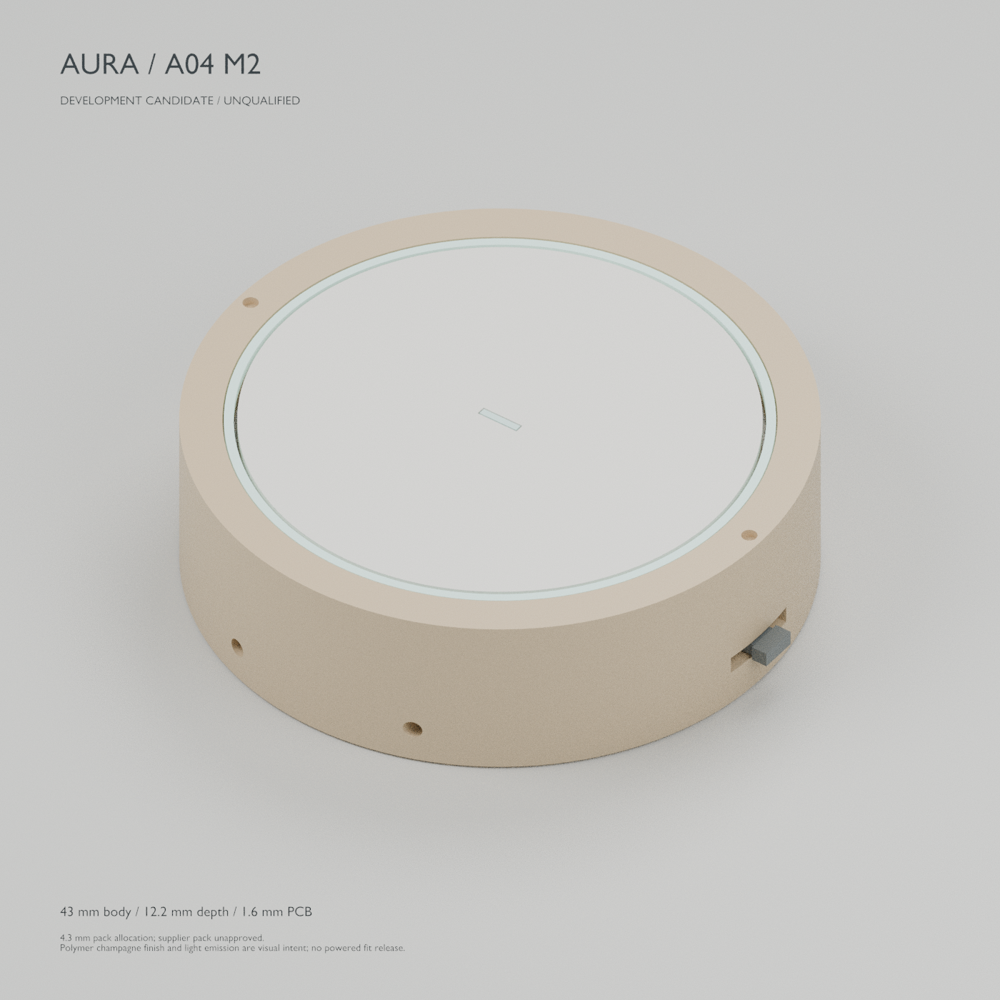
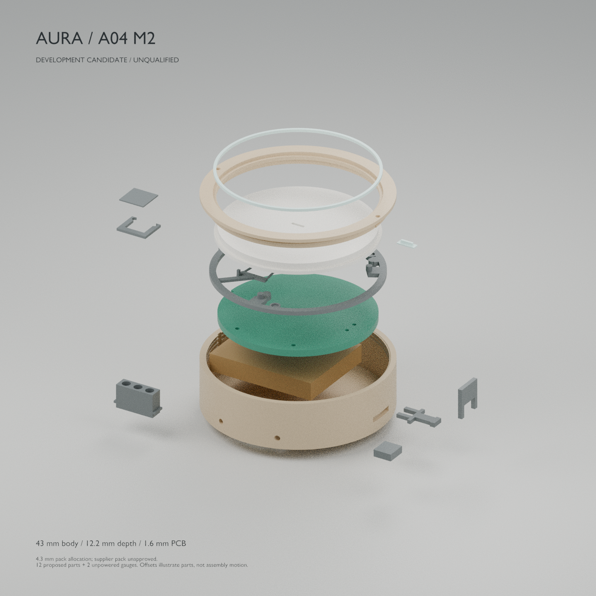

# AURA / pendent

**Capture the context of your life.**

[Explore the A03 showcase](https://pendent-eight.vercel.app) · [Watch the A03 film](https://pendent-eight.vercel.app/film/aura-launch.mp4) · [Download the A03 release](https://github.com/Avinash1286/pendent/releases/tag/a03-context-dev) · [Run the notes portal](portal/README.md)

An open product-development project for a compact necklace AI note-taking device. Electronics, printable industrial design, chip firmware, local transcription, a Next.js / Convex notes portal, an interactive Three.js showcase and a Hyperframes launch film live together here.

## A04 circular redesign — in progress

A04 is a fresh circular design created through **KiCad MCP**, with a physical microphone disconnect, separate update-storage hardware and a source-preserving audio protocol. The current M2 mechanism is **43 mm across and 12.2 mm deep**, accommodating the actual 1.6 mm draft PCB and a 4.3 mm pack allowance. An 11.2 mm variant requires an unselected thinner pack. The earlier 40 × 10 mm goal remains an aspiration, not the dimensions of these files. **A04 is not ready to fabricate, print as a complete device, wear or sell.**

[Full objective and evidence gates](docs/a04/requirements.md) · [New KiCad project](hardware/a04/aura-a04.kicad_pro) · [Mechanical contract](docs/a04/industrial-design.md) · [Software contract and recovery tests](docs/a04/software-contract.md) · [Omi source review](docs/research/omi-review.md)

The current checkpoint includes a **72-reference schematic candidate**, monitored microphone driver, bounded audio FIFO, recorder, shared C/Python Opus archive, recoverable NAND journal and SPI command core. The [storage owner and release outbox](firmware/a04/STORAGE.md) now reserve capture identities and release explicitly authorized recordings through a durable grant, with real C/Python audio round trips on modeled NAND. The nRF52840 DK build records linked memory and symbols in [the current wired-bench ELF resource report](firmware/a04/bench/verification/arm-resources.json). Host checks cover driver faults, privacy/stop ordering, capture boundaries, interrupted writes and preserved audio during storage reuse. The companion passes 131 tests; the earlier portal checkpoint retains 24. The schematic still has one ERC error, nine warnings and three net-name mismatches; the board is not placed or routed. [Native capture evidence](docs/a04/native-capture-verification.json) · [Firmware and audio evidence](firmware/a04/README.md) · [Route to your first physical wearable](docs/research/aura-first-wearable.md).

The working local software path now takes a **real C-generated audio archive through local Whisper transcription into Next.js/Convex**. It preserves the original capture, exact audio duration, bookmarks and transcript provenance. Interrupted captures remain explicit, and token rotation does not duplicate an existing source. These checks use synthetic speech; microphone, Bluetooth and worn-device behavior still need physical validation. [Try the archive importer](companion/README.md#a04-archive-import--040) · [Read the verification](companion/VERIFICATION.md) · [Portal provenance and recovery](docs/a04/portal-provenance.md).

The new [first spoken-note bench](firmware/a04/bench/README.md) provides a separate nRF52840 DK application, reviewed microphone/NAND wiring and a UART capture/export tool. It connects the actual drivers and storage code, with explicit recording permission and verified local publication. The image cross-builds; 31 host-client tests and five C orchestration groups cover its software behavior. **No physical audio has been recorded or board flashed.** This prepares the hardware experiment needed before the custom PCB and wearable can be qualified.

The [native Android companion](mobile/android/README.md) provides a local recording library: select an A04 archive, validate its original bytes and Opus audio, listen back, write context, and explicitly copy/share that context with an AI chat. The new [durable download store](mobile/android/DOWNLOADS.md) commits exact source records and resume metadata together, replays saved prefixes after reopening, and passes completed downloads through the library's actual decoder and publication checks. The current [development APK](https://github.com/Avinash1286/pendent/releases/tag/a04-android-recovery-dev) passed **29 Android emulator cases / 428 assertions**, with zero lint findings. The shared complete/incremental validator and transfer codecs pass **30 JVM groups / 82,213 checks**, including six incremental groups / 49,471 checks and 19 complete C-generated archives. The real Android GATT path also passed **four virtual-link cases / 33 assertions at each of MTU 23 and 517**, including a second connection without duplicate library entries. The peripheral is a Python fixture, not Zephyr firmware or physical radio. Original recordings and physical-OPEN provenance remain preserved. The Activity still exposes file import; Bluetooth download is not yet a user-facing feature. [Verification](mobile/android/VERIFICATION.md).

A [bounded journal cursor](firmware/a04/JOURNAL-CURSOR.md) prepares pendant-to-phone recovery: exact-record resume, at most one NAND read per step, source checks before streaming and again before completion, and cancellation that preserves the original recording. It is exercised through the wired DK export path. A portable [transfer command owner](docs/a04/transfer-wire-v1.md) adds ordered retries, owned capture selection and protection against stale response callbacks; 12 C test groups pass. Android now has the durable source store, library handoff and [foreground recovery owner with a native GATT client](mobile/android/RECOVERY.md). The device radio DK adapter is now implemented separately; owner enrollment, matching Android proof integration and consumer UI remain, followed by physical recovery and OS background qualification. [Transport integration plan](docs/a04/mobile-transport.md).

The new [authenticated Bluetooth DK application](firmware/a04/radio/README.md) integrates the actual transfer engine with the recording/storage owner. It adds a physically bounded pairing window, authenticated LE Secure Connections and fresh owner proof before archive access. Eighteen GATT/transfer groups, twelve C authentication groups and nine pairing-policy groups pass with their documented modeled boundaries. The ARM image uses 243,652 bytes RAM, leaving 18,492 bytes unallocated; runtime headroom is unmeasured. [Download the DK development build](https://github.com/Avinash1286/pendent/releases/tag/a04-radio-dk-dev). Consumer enrollment, the matching Android proof exchange and physical radio/capture trials remain; the older Android/Bumble tests do not execute this firmware.

The **M2 S1 mechanism** keeps the removable bezel and supported PCB, replacing inadequate resin bending links with a separate steel shoe/support and insulating contact pad. Each depth variant contains **12 polymer part models, three hardware form models and two unpowered gauges**. The metal/film forms are not functional resin-print instructions. Mesh and sampled motion checks cover the revised assembly; analytical force screening supports further unpowered joint testing. Materials, tolerances, switch endpoints, all 72 native PCB features, the battery and real assembly remain unqualified. [Blender source, parts and checks](enclosure/a04/mechanism-m2/README.md) · [Steel development drawings and 1:1 DXF profiles](enclosure/a04/mechanism-m2-manufacturing/README.md) · [Earlier process coupon kit](enclosure/a04/coupon/README.md).

Inspect the A04 M2 experimental parts

The exploded offsets show individual parts; separate motion reports check sampled assembly paths. Read the [remaining assembly and release gates](enclosure/a04/mechanism-m2/README.md#assembly-and-release-gates) before using these files. The [M1 experiment and its failures](enclosure/a04/mechanism/README.md) and [original 40 mm appearance study](enclosure/a04/study/aura-a04-study.png) remain available as earlier work.

The website, film, PCB and eight-part print kit linked below belong to the earlier **A03 development release**. They are retained for reproducibility and are not A04 deliverables.

## A03 development release

## Launch film

**[▶ Watch the 44-second film](https://pendent-eight.vercel.app/film/aura-launch.mp4)** · [Download the 1080p MP4](https://github.com/Avinash1286/pendent/releases/download/a03-context-dev/aura-launch.mp4) · [Hyperframes source](film/aura-launch/README.md)

See the pendant from the outside in, including its interior and assembly animation. Click the poster to play.

## 3D-printable parts

Rendered from the actual STL files; individual views are not to scale. The kit includes six device parts and two fit/alignment tools. STL units are millimetres; print orientation and material guidance are in the assembly guide.

[Download all eight STL files](enclosure/aura-a03-print-kit.zip) · [Print and assembly guide](enclosure/PRINTING.md) · [Editable Blender scene](enclosure/aura-product.blend)

## PCB

The **24 × 42 × 0.8 mm, four-layer board**, shown directly from its native KiCad copper layers with illustrative colours. These are prototype files; the 78 courtyard findings still require assembly review.

[Editable KiCad project](hardware/native/aura-a03.kicad_pro) · [Prototype fabrication ZIP](hardware/output/aura-a03-prototype-fabrication.zip) · [Schematic and review files](hardware/native/review/)

## Project status

**A03 context and assembly edition.** [Prototype fabrication files](hardware/native/README.md) are exported from the paired KiCad project: zero unconnected items, schematic mismatches, ERC findings or bare-board DRC errors. **78 unsuppressed courtyard overlaps remain for assembly review.** The case has printable meshes with geometric audits; real fit, battery, acoustic and RF tests remain. Firmware is compiled for the nRF52840 but has not run on an assembled AURA. The notes portal uses real local Convex; cloud setup awaits account terms acceptance. This is not a manufactured or certified device, and no orders or payments are accepted. See the [current release guide](docs/release-a03-context.md) for downloads and verification.

## Project map

New: [Omi codebase review and AURA first-wear plan](docs/research/omi-review.md), with a source-based comparison, all 78 assembly collisions classified, and companion recovery improvements. This review identifies a real component-tolerance conflict that requires an A04 placement revision; it does not qualify A03 for assembled-unit ordering.

| Directory | Contents |
| --- | --- |
| `hardware/` | tscircuit source, routed native KiCad board, readable schematic, BOM and validation evidence |
| `enclosure/` | Blender source, editable generator, printable enclosure meshes, GLB and product renders |
| `firmware/` | Zephyr nRF52840 firmware, reproducible tool setup, flashable build artifacts and native tests |
| `companion/` | Bluetooth sync, CRC verification, local Whisper transcription and optional portal upload |
| `mobile/android/` | Native Kotlin local import, durable download storage and replay, verified playback, private context and explicit sharing; A04 wireless integration pending |
| `portal/` | Next.js / Convex private notes, profiles, Context Pack and read-only MCP endpoint |
| `website/` | Interactive React / Three.js product presentation, deployed directly to Vercel |
| `film/` | Hyperframes composition, original soundtrack and rendered launch video |
| `docs/` | Hardware and product engineering notes |

## Design direction

- 48 × 28 × 10 mm capsule body, 54 mm tall including the bail; 24 × 42 mm PCB.
- A glossy black recording paddle in a satin polymer surround, a bookmark gesture, visible microphone-power indication and a physical privacy slider.
- A physical microphone power disconnect, offline local audio storage and Bluetooth transfer to the companion.
- Dual digital microphones, a protected rechargeable-cell candidate and rear contacts for a magnetic charging dock; the complete dock remains to be designed and qualified.
- Local computer transcription and optional notes upload are implemented. The A04 Android source-import and durable download-storage foundation is available; device-to-phone wireless integration remains future work.
- 16 kHz mono PCM storage has an ideal capacity of about 66 minutes before bad blocks and metadata; battery runtime is unmeasured.

## Start exploring

- [Product and interaction specification](docs/product-design.md)
- [Hardware source and validation](hardware/README.md)
- [Print and assembly guide](enclosure/PRINTING.md) · [eight-part print kit](enclosure/aura-a03-print-kit.zip) · [editable Blender scene](enclosure/aura-product.blend)
- [Firmware build / flash / bring-up](firmware/README.md)
- [Install the local companion](companion/README.md)
- [Run AURA Notes and connect any AI](portal/README.md)
- [Launch film and reproducible Hyperframes source](film/aura-launch/README.md)

The portable **Context Pack** combines your selected notes, source excerpts, personal background and current goals into reviewed Markdown. Copy or attach it in ChatGPT, Claude, Gemini, Grok, or another chat. Compatible MCP clients can instead read explicitly approved live context through a revocable bearer token. Provider buttons do not send data automatically.

## Publication

Sources and generated deliverables are shared here. Website deployment uses Vercel directly; this project does not use GitHub Actions. Dependencies, signing keys, tokens, private local recordings and database files are intentionally excluded. Each workstream documents reproducible setup and the checks actually completed.

## Upstream tools

[tscircuit documentation](https://docs.tscircuit.com/) · [Blender](https://www.blender.org/) · [Three.js](https://threejs.org/docs/) · [Hyperframes](https://github.com/heygen-com/hyperframes) · [Vercel](https://vercel.com/docs)
