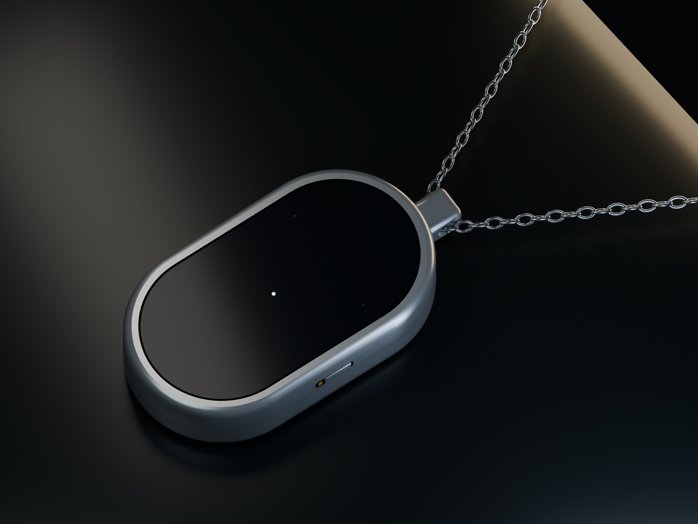
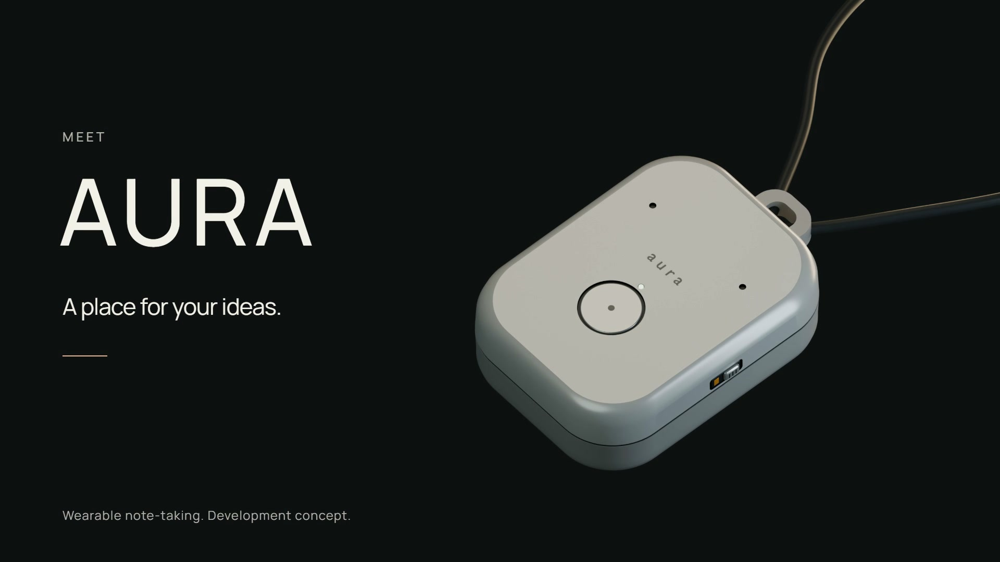
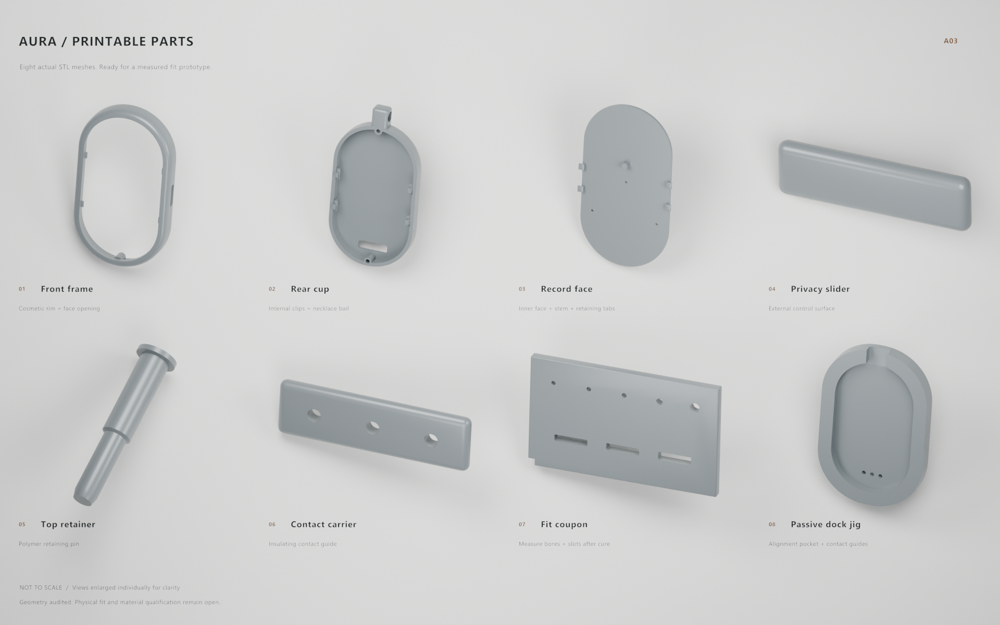
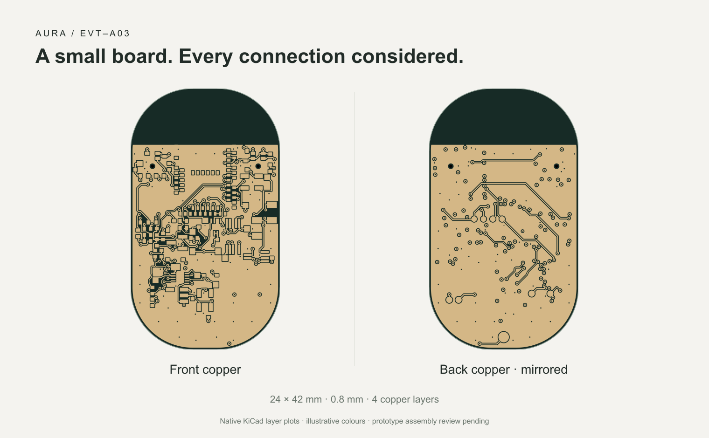

# AURA / pendent

**Capture the context of your life.**

[Explore the live 3D product](https://pendent-eight.vercel.app) · [Watch the launch film](https://pendent-eight.vercel.app/film/aura-launch.mp4) · [Download the release](https://github.com/Avinash1286/pendent/releases/tag/a03-context-dev) · [Run the notes portal](portal/README.md)

An open product-development project for a compact necklace AI note-taking device. Electronics, printable industrial design, chip firmware, local transcription, a Next.js / Convex notes portal, an interactive Three.js showcase and a Hyperframes launch film live together here.

## Launch film

**[▶ Watch the 44-second film](https://pendent-eight.vercel.app/film/aura-launch.mp4)** · [Download the 1080p MP4](https://github.com/Avinash1286/pendent/releases/download/a03-context-dev/aura-launch.mp4) · [Hyperframes source](film/aura-launch/README.md)

See the pendant from the outside in, including its interior and assembly animation. Click the poster to play.

## 3D-printable parts

Rendered from the actual STL files; individual views are not to scale. The kit includes six device parts and two fit/alignment tools. STL units are millimetres; print orientation and material guidance are in the assembly guide.

[Download all eight STL files](enclosure/aura-a03-print-kit.zip) · [Print and assembly guide](enclosure/PRINTING.md) · [Editable Blender scene](enclosure/aura-product.blend)

## PCB

The **24 × 42 × 0.8 mm, four-layer board**, shown directly from its native KiCad copper layers with illustrative colours. These are prototype files; the 78 courtyard findings still require assembly review.

[Editable KiCad project](hardware/native/aura-a03.kicad_pro) · [Prototype fabrication ZIP](hardware/output/aura-a03-prototype-fabrication.zip) · [Schematic and review files](hardware/native/review/)

## Project status

**A03 context and assembly edition.** [Prototype fabrication files](hardware/native/README.md) are exported from the paired KiCad project: zero unconnected items, schematic mismatches, ERC findings or bare-board DRC errors. **78 unsuppressed courtyard overlaps remain for assembly review.** The case has printable meshes with geometric audits; real fit, battery, acoustic and RF tests remain. Firmware is compiled for the nRF52840 but has not run on an assembled AURA. The notes portal uses real local Convex; cloud setup awaits account terms acceptance. This is not a manufactured or certified device, and no orders or payments are accepted. See the [current release guide](docs/release-a03-context.md) for downloads and verification.

## Project map

New: [Omi codebase review and AURA first-wear plan](docs/research/omi-review.md), with a source-based comparison, all 78 assembly collisions classified, and companion recovery improvements. This review identifies a real component-tolerance conflict that requires an A04 placement revision; it does not qualify A03 for assembled-unit ordering.

| Directory | Contents |
| --- | --- |
| `hardware/` | tscircuit source, routed native KiCad board, readable schematic, BOM and validation evidence |
| `enclosure/` | Blender source, editable generator, printable enclosure meshes, GLB and product renders |
| `firmware/` | Zephyr nRF52840 firmware, reproducible tool setup, flashable build artifacts and native tests |
| `companion/` | Bluetooth sync, CRC verification, local Whisper transcription and optional portal upload |
| `portal/` | Next.js / Convex private notes, profiles, Context Pack and read-only MCP endpoint |
| `website/` | Interactive React / Three.js product presentation, deployed directly to Vercel |
| `film/` | Hyperframes composition, original soundtrack and rendered launch video |
| `docs/` | Hardware and product engineering notes |

## Design direction

- 48 × 28 × 10 mm capsule body, 54 mm tall including the bail; 24 × 42 mm PCB.
- A glossy black recording paddle in a satin polymer surround, a bookmark gesture, visible microphone-power indication and a physical privacy slider.
- A physical microphone power disconnect, offline local audio storage and Bluetooth transfer to the companion.
- Dual digital microphones, a protected rechargeable-cell candidate and rear contacts for a magnetic charging dock; the complete dock remains to be designed and qualified.
- Local computer transcription and optional notes upload are implemented. A mobile companion remains future work.
- 16 kHz mono PCM storage has an ideal capacity of about 66 minutes before bad blocks and metadata; battery runtime is unmeasured.

## Start exploring

- [Product and interaction specification](docs/product-design.md)
- [Hardware source and validation](hardware/README.md)
- [Print and assembly guide](enclosure/PRINTING.md) · [eight-part print kit](enclosure/aura-a03-print-kit.zip) · [editable Blender scene](enclosure/aura-product.blend)
- [Firmware build / flash / bring-up](firmware/README.md)
- [Install the local companion](companion/README.md)
- [Run AURA Notes and connect any AI](portal/README.md)
- [Launch film and reproducible Hyperframes source](film/aura-launch/README.md)

The portable **Context Pack** combines your selected notes, source excerpts, personal background and current goals into reviewed Markdown. Copy or attach it in ChatGPT, Claude, Gemini, Grok, or another chat. Compatible MCP clients can instead read explicitly approved live context through a revocable bearer token. Provider buttons do not send data automatically.

## Publication

Sources and generated deliverables are shared here. Website deployment uses Vercel directly; this project does not use GitHub Actions. Dependencies, signing keys, tokens, private local recordings and database files are intentionally excluded. Each workstream documents reproducible setup and the checks actually completed.

## Upstream tools

[tscircuit documentation](https://docs.tscircuit.com/) · [Blender](https://www.blender.org/) · [Three.js](https://threejs.org/docs/) · [Hyperframes](https://github.com/heygen-com/hyperframes) · [Vercel](https://vercel.com/docs)
