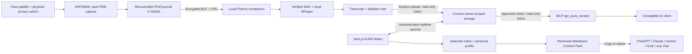

# From a thought to useful context

The pendant captures audio; transcription runs on the local computer. The portal receives text only through the supplied upload path. Nothing opens an AI provider or sends context merely because a recording is captured. The owner controls live-note inclusion; a device token may opt future uploads into live context only when created with that explicit choice. A context token can read the profile and enabled notes but cannot write them.

## Interfaces

- [Hardware and physical pin mapping](hardware.md)
- [Bluetooth command, response and CRC contract](ble-protocol.md)
- [Firmware storage recovery and maintenance](../firmware/README.md)
- [Companion installation, transcription and upload](../companion/README.md)
- [Portal setup, HTTP schema and MCP connection](../portal/README.md)

## Data lifecycle

Capture closes on a physical press, privacy cutoff, low voltage or storage error. Committed journal pages can recover an interrupted recording. Sync copies bytes, verifies per-chunk and whole-record CRC, then writes a WAV. The device copy remains until an explicit verified delete. Reclaiming NAND requires every record to be deleted plus a physical maintenance hold and confirmed command.

Whisper produces a local transcript. Default summaries are extractive; optional local Ollama output stays editable. Upload sends a note with a stable source identity, making retries idempotent within the configured ingestion token. Uploaded originals are stored independently from exported Context Packs. Archiving removes a note from live context immediately and can be reversed.

Export includes source titles, capture dates and transcript excerpts. Large packs are explicitly truncated in the preview rather than silently claiming complete context. Captured text is marked untrusted source data; downstream model behavior remains the AI provider's responsibility.

See [A03 release status](release-a03.md) for what was actually tested and what remains incomplete. Physical AURA operation, mobile UX, cloud hosting, password recovery, account deletion, encryption at rest and signed firmware updates are not established by the local software tests.
