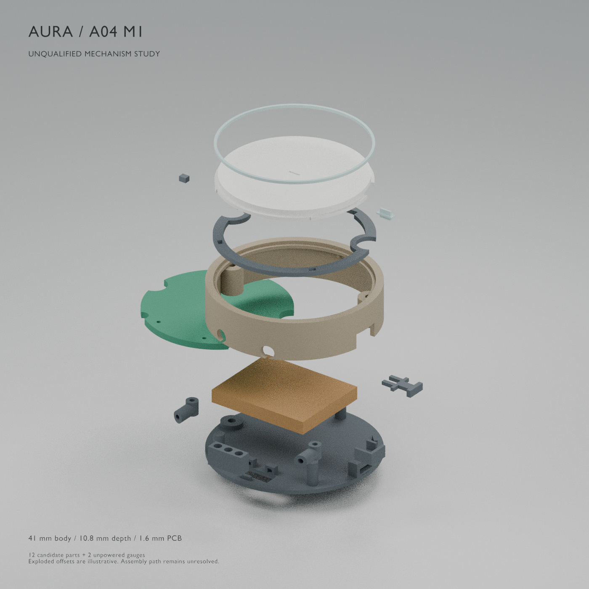

# AURA A04 M1 — mechanism experiment

**This is an unqualified experimental part set, with known assembly and motion failures. It is not a complete-body print release or a fabrication-ready enclosure.** The native PCB and its JS202011JCQN privacy switch remain unchanged. The component blocks in Blender are proposed allocations, not imported final placements.



The inspection image uses the actual generated part meshes, with colour and display offsets for legibility. The green disk and ochre block are unpowered fit gauges. Exploded offsets are not an insertion sequence. [Render provenance](inspection-render.json) binds the image to its source assembly. The separate [visual review](visual-review.json) applies only to this exact PNG; regeneration cannot automatically claim a new image was inspected.

## What this checkpoint adds

M1 explores **Ø41 mm**, preserving the Ø35.2 mm face from the existing [process coupon](../coupon/README.md). It retains the pale face, fine rim, short bail, central status dash and deliberate face gesture. The earlier [Ø40 mm appearance study](../design-contract.json) is preserved as a separate proposal; M1 does not silently replace its contract or evidence.

Guides, retaining flange, overload stops and return-foam pockets use the radial annulus and existing component-height region. No extra full-depth mechanism band was added. The 1 mm diameter increase accommodates the proposed underside DPDT switch and shifted cell more credibly, but the small remaining gaps are not tolerance-qualified.

| Scenario | Body diameter × depth | PCB thickness | Maximum cell gauge | Status |
|---|---:|---:|---:|---|
| [thin-cell](thin-cell/parts-manifest.json) |41 ×10.8 mm|1.6 mm actual native thickness|26 ×21 ×3.3 mm|Controlled goal; no qualified battery|
| [documented-pack](documented-pack/parts-manifest.json) |41 ×11.8 mm|1.6 mm actual native thickness|26 ×21 ×4.3 mm|Larger allocation around dated LP402024 maximum25 ×20.5 ×4.3 mm; pack remains unselected|

Both use the same XY proposals. The additional 1 mm depth in the second scenario follows the actual cell-depth difference. A 0.8 mm board is a target only; it has not been authored into the native board or these two candidates. Pack/PCM/NTC uncertainty remains in the [battery review](../../../docs/a04/battery-candidate-review.md).

## Exported specimens

Each scenario contains **14 separate binary STLs: 12 candidate device parts and 2 unpowered gauges**. STL coordinates are millimetres, with each minimum Z placed at zero; this is a neutral export datum, not a support/orientation recommendation. The Blender source keeps assembly XYZ in millimetre coordinates with scene `scale_length=0.001`. Each `parts-manifest.json` records `printTranslationMm` to recover its assembly position. The older appearance/coupon Blender sources use their own documented metre convention.

| File prefix | Specimen and intended role |
|---|---|
|01|Hollow front housing with integral short bail, guide channels, lip, nut pockets and side access|
|02|Captive face paddle with flange, three guide keys and blind sizing-insert socket|
|03|Retainer with overload stops, foam openings, boss bridges and radio relief|
|04|Separate fixed diffuser ring|
|05|Moving central status lightpipe|
|06|Replaceable plunger sizing blank; **safe powered actuation is unresolved**|
|07|Rear cover, location keys, rear columns and privacy-fork keeper|
|08|Proposed CUS22 privacy fork with real slot and external grip|
|09 LEFT / RIGHT|Two separate hollow acoustic L ducts, Ø1.3 mm open bores|
|10|Keyed insulating dock-contact access carrier|
|11|Right lower sensor carrier with open-top lead relief|
|90|Unpowered Ø35.2 ×1.6 mm board gauge with proposed notches/ports; **differs from native board**|
|91|Unpowered maximum pack gauge; no electrical cell and no additional0.4 mm growth layer|

Purchased component envelopes, return-foam allocations and nominal screws are in the assembly BLEND as clearly named proposals and are excluded from the print STLs. Neither a populated PCB nor a working battery is rendered as though it were final hardware.

## Verification and known failures

Both scenarios pass 14/14 independent binary-STL checks: exact bytes/hash, one connected solid, oriented manifold edges, nondegenerate triangles, positive volume, and full XYZ export bounds reconstructed through the recorded translation. Current generator, contract and assembly hashes must also match. The tolerance for the bound comparison is0.005 mm; this is an export check, not printer accuracy. The checks do not prove freedom from every possible self-intersection or suitability for a selected printer.

The expanded CSG audit checks all printed pairs at rest; six rigid component bounds against every printed solid and each other; five face positions against all stationary printed solids and component bounds; and five nominal fork/lever positions against their surroundings. It uses an intersection threshold of0.001 mm³. **Both scenarios deliberately report `allRigidTrialChecksPass:false` and `nonActuatingRigidClearancesPass:false`.** See the [thin-cell motion report](thin-cell/motion-audit.json) and [documented-pack report](documented-pack/motion-audit.json).

| Finding | Evidence and required correction |
|---|---|
|Blocked straight rear face insertion|The unnotched face skin spans radius17.6 at Z`D−1.05..D−0.05`. Integral screw bosses rise through Z`1..D−1.8` and intrude to about radius15.1. Moving the full disk axially from the rear crosses those bosses. Front insertion is also obstructed by the retaining flange extending beyond the front aperture. A tilted route has not been proven. Revise the construction, such as a separately retained skin or removable boss assembly, and verify an actual insertion path.|
|No positive axial PCB seat/retention|The gauge is placed at the intended PCB plane. Columns pass through clearance notches; the retainer is0.3 mm above the PCB top and the cell ends0.55 mm below the PCB underside. The two proposed gasket contacts are on the same lower edge. There is no defined three-point support or clamp maintaining that datum and growth space. Add and test a support/retention process before treating the stack as fixed.|
|Status lightpipe / radio collision|At0.4 mm inward face travel, the moving lightpipe intersects the proposed maximum radio envelope by about0.022 mm³ in both depth scenarios. Shorten/reroute the optical coupling or reconcile the component placement, then rerun the full sweep.|
|Capture actuation unresolved|The sizing blank meets the nominal KMR2 bound after the0.05 mm rest gap. A0.4 mm face stroke demands0.35 mm switch depression. Published electrical travel0.2±0.1 mm does not establish safe mechanical overtravel. The report retains all four contact findings; it does not waive them as a pass. Measure and shorten the insert or qualify compliance.|
|Native privacy switch conflicts with the thin stack|The original JS202 body/actuator is about5.5 mm tall nominal. The proposed CUS22 underside layout is only a candidate; native MPN/footprint have not changed. Full terminal/anchor grounding and motion must be accepted before substitution.|
|Small unqualified pack clearances|Maximum gauge to cavity minimum0.293 mm, to left boss0.190 mm, to proposed privacy body0.250 mm. These are scalar nominal clearances, not acceptance margins for cell protection, adhesive, printing, assembly or supplier tolerances. The separately reserved0.4 mm growth region is not included in the rigid gauge or the CSG audit.|

At rest, the tested printed pairs, six maximum/nominal component bounds and component-bound pairs have no intersections above the threshold. Five coupled fork/lever samples at−0.75..+0.75 mm also have none. This does **not** prove fork take-up, electrical contact timing, worst-case stroke or the unshimmed2.4 mm shell travel; endpoint shims remain undesigned. No continuous sweep, insertion sequence, force model or all-package native layout is verified.

## Proposed PCB and interface negotiation

[The analytic allocation report](allocation-audit.json) contains all six transformed signal-pad corners, four anchor-pad sets and both NPTH centres for the CUS22 candidate, plus the explicit backside reflection/rotation and board-origin mapping. [The inspected pad drawing](evidence/cus22-pad-detail.png) and [body drawing](evidence/cus22-body-detail.png) are excerpts of page3 of the [Nidec manufacturer PDF](https://www.nidec-components.com/e/catalog/switch/cus.pdf). The native-footprint owner must independently confirm the drawing view before authoring this map.

The two drawing excerpts remain Nidec manufacturer material, included for technical source review and attribution. They are not part of AURA's original-code MIT grant; no permission, alternate licence or manufacturer endorsement is implied.

The proposed CUS centre is CAD(13.50,0), long axis Y, underside mounting. The worst actual signal-pad corner is(16.8,±2.6): radius17.0 in the native radius17.6 circle, giving **0.600 mm nominal edge clearance against the existing0.500 mm copper-to-edge rule**. The0.100 mm nominal margin does not include fabrication tolerances or changed board notches. A rectangular8.9 ×7.2 mm candidate courtyard includes empty corners that may extend beyond the circular outline. Full leads and solder anchors are not present as CSG solids; the separately reported conservative lead bound is an inference, not imported manufacturer CAD. Four unnumbered anchors and the manufacturer's “ground terminal” wording require electrical clarification.

Two closure notches of radius3.05 mm at(−17.79,−0.10),(16.5,6.5) and three column notches of radius1.6 mm at polar angles90°,230°,320°, radius17.8, are **proposals absent from the native outline**. The retainer is more than a simple edge annulus: its two local bridges reach inward to about radius13.4, with an upper radio relief. The exact saved solid must be imported when negotiating keepouts.

Other proposed interfaces are the radio at(0,8.6), motor at(6,−5), face switch at(−5,−4), status LED at(0,0), microphone ports at(±6.5,−13.8), rear dock row at X−3,0,3/Y−15.5, and sensor at(13.2,−7). They are not accepted placements. The radio maximum10.7 ×15.7 ×2.25 mm includes an additional0.15 mm seating allocation; its real antenna copper/metal keepout is not imported. The motor mounted bound isØ10.1 ×2.45 mm; its6.6 mm tab reach and lead routes still need explicit solids/keepouts.

The ducts provide real drillable/inspectable openings and a0.4 mm working gasket gap, but no qualified acoustic boot, port datum, seal or response. The sensor has a side-contact pocket rather than sitting on top of the cell; the0.1 mm interface, thermal adhesive and lead anchorage are unqualified. The dock access targets proposed B.Cu pads. A3.8 mm mid-stroke pogo needs a raised nose of1.2 mm in the thin scenario or2.2 mm in the deeper one; raw pins cannot reach the recessed plane. The complete keyed dock remains separate work.

## Material, fasteners and physical trial procedure

Rigid parts are candidates for separately washed and cured engineering SLA, with the original face/rim coupon printed in the same orientation/process first. The0.2–0.25 mm moving gaps are **not universal print clearances**. Formlabs gives larger generic moving-clearance recommendations for [Tough2000](https://now.formlabs.com/resources/tough-2000-resin), and [its material guidance](https://formlabs.com/support/Using-Tough-Resin/) does not establish these parts as cyclic flexures. Accordingly, returns are three separate, unselected silicone-foam pieces, not printed resin springs. Their nominal1 ×1.5 ×1.6 mm allocation and geometric compression require measured preload, force, creep and life. Clear diffuser and dash trials need separate optical/material qualification. Champagne is a shader/finish intention; no metal RF enclosure or skin-contact approval is implied.

The closure studies M1.6 ×6 DIN85 slotted pan-head screws with nominalØ3.2 ×1.0 mm heads, using [manufacturer-listed dimensions](https://www.accu.co.uk/slotted-pan-head-screws/916920-SFP-M1-6-6-A4-R360), and M1.6 ISO4032 nuts (AF3.2 mm maximum, height1.3 mm maximum) from the [fastener drawing](https://www.rcfastener.com/documents/RC_Specs/Metric_Hex_Nut_Style1_Class6_ISO4032.pdf). The linked screw variant includes locking treatment; it is dimensional evidence, not approval to apply that treatment to resin. A plain exact supplier part, installation tool, thread engagement, torque, boss strength and disassembly life remain to be selected/tested.

Use only the unpowered gauges for this checkpoint's physical trials. Measure the original coupon first, inspect and clear every duct, verify each nut can reach its6.8 mm seat through the rear channel without trapping a tool, and check the rear screwdriver approach. Bench-test the fork/keeper with an actual switch separately and measure its take-up/contact/stop positions. The sensor, contact carrier, return pads and any adhesive need defined insertion and retention sequences. Do not infer those paths from a collision-free final pose. Record the blocked full-face insertion and missing PCB support; this checkpoint cannot supply a complete assembly guide until those mechanisms change. No powered-cell assembly is qualified by these files.

## Reproduce and inspect

Blender5.2.1 LTS generated the candidates. Run from this directory with Blender and Python on PATH:

```powershell
blender -b -t 2 --python build_mechanism.py -- --scenario thin-cell
blender -b -t 2 --python build_mechanism.py -- --scenario documented-pack
python verify_meshes.py --scenario thin-cell
python verify_meshes.py --scenario documented-pack
blender -b -t 2 --python check_motion.py -- --scenario thin-cell
blender -b -t 2 --python check_motion.py -- --scenario documented-pack
python audit_allocation.py
blender -b -t 2 --python render_mechanism.py
python package_checkpoint.py
```

The final [readiness and hash report](mechanism-readiness.json) records all sources, exports and evidence. Regeneration may change Blender metadata/binary hashes; rerun dependent checks and the manifest together. The manifest's experimental readiness result remains false while the recorded design failures are unresolved.
