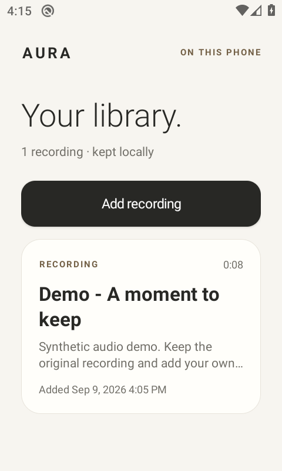
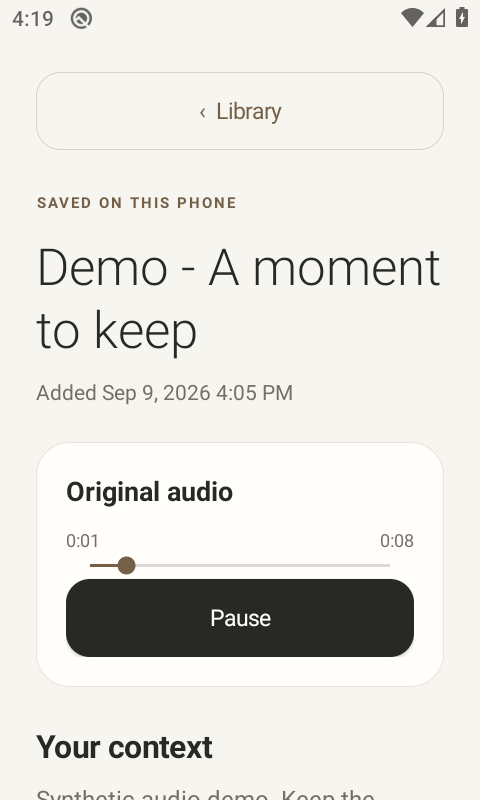

# AURA for Android

A native, local library for experimental A04 recordings: import an original archive, listen to its verified audio, add your own context, and choose what to copy or share with an AI chat. Android 10 / API 29 or newer is required.

[Download the development APK](https://github.com/Avinash1286/pendent/releases/download/a04-android-recovery-dev/aura-a04-android-debug.apk) · [Release files and checksums](https://github.com/Avinash1286/pendent/releases/tag/a04-android-recovery-dev) · [Verification](VERIFICATION.md)

 

This is the phone-side file-import foundation for A04. It does **not** yet connect to a pendant over BLE, enroll a device, download recordings over the air, transcribe speech, sync with the web portal, or record in the background. The proposed next transport is documented in [mobile-transport.md](../../docs/a04/mobile-transport.md). This app is not evidence that a fabricated wearable is ready to use.

The current APK also contains the [durable download store](DOWNLOADS.md): validated transfer records and resume metadata commit together in SQLite, and a completed source can enter this same playable library. Its storage and decoding paths have passed Android runtime checks. The new [foreground recovery owner and Android GATT client](RECOVERY.md) connect that storage foundation to a serialized transport lifecycle. Consumer downloads still require ownership enrollment, the matching device radio service and Activity integration. See the [verification record](VERIFICATION.md) for the executed scripted-link and virtual-radio scope. The screenshots above show the earlier local-import UI, which this change does not replace.

## Use the local library

1. Tap **Add recording**. In Android's document picker, select one complete A04 archive and, optionally, its matching physical receipt in the same selection. Typical filenames are `.aura` and `.physical.ack3`; the app identifies **AUR3** and **ACK3** bytes, not a filename or MIME type.
2. Wait for validation. The app first copies the selected sources into private storage. For nonempty Opus recordings, it validates the complete archive, builds a derived Ogg, decodes through the platform decoder's output end-of-stream, and verifies the exact retained sample count before publishing playable audio.
3. Open the recording to play, pause, seek, and edit its title or **Your context**. Context is written by you; the app does not invent a transcript. A valid empty capture is retained and explicitly has no playable audio.
4. Use **Copy context for AI** to paste into ChatGPT, Claude, Gemini, Grok, or another text interface. **Share context…** opens Android's chooser. Both actions send only the context you chose, with the original archive's SHA-256, retained duration, and an interrupted-recording qualification when applicable. They do not automatically contact an AI service or attach audio.
5. Use **Export original recording…** to write the unchanged archive to a destination you choose. This exports the archive only: editable context and the optional physical receipt are not included. Keep the original receipt separately and copy/share context you want to preserve outside the app.

Playback is tied to the visible activity. Leaving the app stops playback. The implementation releases audio focus when playback ends, pauses on focus loss, and pauses when headphones disconnect so a pending or playing recording does not deliberately continue through the phone speaker. The API 29 UI check exercised playback to completion; physical headset routing and other-app audio-focus behavior still need the broader runtime checks described below.

## Understand recording and receipt status

The archive's terminal seal and a physical device receipt answer different questions:

| Imported evidence | Meaning shown or retained by the app |
| --- | --- |
| Complete finalized archive, no physical receipt | The file declares an exact completed duration; device-side termination provenance remains unknown. |
| Complete interrupted archive | Only the retained portion is known. The original recording's full duration is unknown. |
| Matching finalized or interrupted physical ACK3 | The supplied receipt must exactly match the independently verified terminal archive receipt. |
| Physical **OPEN** ACK3 plus a complete interrupted export | The physical receipt covers the unsealed prefix before the export's derived interrupted seal. It does not establish that the device physically wrote that seal. |

A raw unsealed prefix is not a complete importable archive. The Android parser rejects it, along with truncated records, trailing bytes, malformed metadata, and mismatched receipts; it does not silently repair the source.

If you later obtain a receipt for an already imported archive, select **the same archive and that receipt together**. An exact retry is idempotent. Unknown physical provenance can acquire a strictly matching receipt; a conflicting receipt is refused. Different terminal digests are distinct capture revisions. CRCs and SHA-256 establish byte consistency, not authenticated device identity. Importing or exporting a file does not issue a device durable-ACK or authorize deletion from a pendant.

The byte contract is defined in [ARCHIVE.md](../../firmware/a04/ARCHIVE.md), with parser details in the [Kotlin core guide](core/README.md).

## Storage, recovery, and limits

The app stores its library under Android's private `noBackupFilesDir/captures`:

```text
captures/
  inventory.sqlite               # Editable titles/context and source inventory
  store.lock                     # Serialized publisher/recovery ownership
  .pending/<unique-import>/      # Copied sources awaiting successful publication
  complete/<device>_<capture>_<terminal-digest>/
    source.aura                  # Unchanged original
    physical.ack                 # Optional strictly matched receipt
    bundle.json                  # Source identity and completed decode metadata
    source.opus                  # Derived Ogg Opus, for nonempty captures
    playback.wav                 # Validated PCM playback, for nonempty captures
```

One worker owns app operations, with a process/file lock around store mutations. The publication sequence syncs completed files, renames the private bundle, syncs the affected directories, and then commits its SQLite inventory row with FULL-or-stronger synchronization. A late physical receipt is a new validated sidecar; it does not rewrite the original archive or base bundle metadata. Title and context edits change SQLite only.

On a fresh store opening, recovery scans published complete bundles, revalidates original hashes/receipts and retained playback metadata/files, and rebuilds missing inventory rows. Existing title/context edits are preserved when their database is readable. A changed source, missing previously known receipt, or conflicting bundle is retained and excluded from the usable inventory. Rebuilding an absent database can recover capture inventory from complete bundles, but cannot reconstruct lost manual notes.

An import that fails parsing, decoding, limits, or publication leaves its private pending files in place; bytes already copied from an oversized or interrupted input are retained too. Selected external files are never rewritten. Exact duplicate retries also leave the extra pending copy. There is currently no automatic pending cleanup or in-app pending recovery/export interface, so repeated retries and long decoded recordings consume storage. Recovery ordering is implemented and testable; it is not a claim that sudden power loss has been physically tested.

| Bound | Current implementation |
| --- | --- |
| Selected inputs | One `content://` archive, optionally one receipt; at most two selections |
| Archive copy/file size | 128 MiB; combined input allowance is 128 MiB plus 94 receipt bytes |
| Physical receipt | Exactly 94 bytes |
| Archive records | At most 1,000,000 audio/bookmark records |
| App playback format | A04 mono Opus at a 16 kHz source rate; PCM archives are retained as failed imports with an unsupported-format message |
| Derived Ogg | At most 160 MiB, further bounded by archive payload and record limits |
| Derived WAV | At most 2 GiB including its 44-byte header; preflight allows for the platform's possible 48 kHz PCM output |
| Platform decode | PCM16 mono at 16 or 48 kHz, complete output EOS, exact retained duration, one remaining terminal trim when required |
| Decode time | Ten-second no-progress bound and a duration-based total budget capped at ten minutes |
| Editable text | Title up to 120 characters; context up to 20,000 characters |

The library is excluded from Android cloud backup and device transfer through `noBackupFilesDir`, `allowBackup=false`, and extraction rules. **Uninstalling the app or clearing its storage removes private recordings, pending imports, and manual context.** Keep independent copies using the explicit export/copy/share actions and retain your original external receipts. The app's private storage is not an external backup.

## Build on Windows

Run these commands from the repository root. The provided scripts use a workspace-local JDK, Gradle, Android SDK, and caches under `.tools/android`; they do not require Android Studio or an NDK.

Prerequisites are PowerShell, `curl.exe`, [`uv`](https://docs.astral.sh/uv/getting-started/installation/), and a working `ffmpeg` on `PATH`. The default verification command uses the locked companion Python environment, whose Python requirement is 3.12 or 3.13. Internet access is needed for the initial tool and dependency downloads.

```powershell
.\mobile\android\setup.ps1
.\mobile\android\build.ps1
```

`setup.ps1` verifies the pinned JDK, Gradle, and command-line-tools archives, accepts the SDK licenses as part of installation, and installs platform 37.0, build tools 36.0.0, and platform tools. It does not select a phone, flash firmware, or change Windows virtualization settings. Version and download background is in [TOOLCHAIN.md](TOOLCHAIN.md) and [toolchain-lock.json](toolchain-lock.json); that review document describes its earlier inspection, not a later runtime result.

`build.ps1` first runs the cross-language core verification, then builds the debug app, builds the test APK, and runs Android lint. The outputs are:

```text
mobile/android/app/build/outputs/apk/debug/app-debug.apk
mobile/android/app/build/outputs/apk/androidTest/debug/app-debug-androidTest.apk
mobile/android/app/build/reports/lint-results-debug.html
```

For a focused rebuild after unchanged core checks have already passed:

```powershell
.\mobile\android\build.ps1 -SkipCore
```

`-SkipCore` skips verification; it is not evidence that those checks passed. The debug APK uses local development signing and is not a Play Store/release-signed artifact. SDKs, caches, local signing material, and build outputs belong outside Git.

To retain the exact build inputs, APK hashes, lint result and runtime output in the verification directory:

```powershell
uv run --project companion --locked python mobile/android/scripts/verify_android.py build
uv run --project companion --locked python mobile/android/scripts/verify_android.py runtime --serial '<device-serial>'
```

The runtime command first checks that the current sources and APKs match the successful build report, then installs both development APKs on that explicit target and runs the isolated instrumentation. It does not wipe or uninstall the target. It refuses a failed or missing instrumentation result even when `adb` itself returns zero.

To install on a deliberately selected emulator or Android phone with debugging enabled:

```powershell
$auraAdb = '.\.tools\android\sdk\platform-tools\adb.exe'
& $auraAdb devices -l
& $auraAdb -s '<device-serial>' install -r '.\mobile\android\app\build\outputs\apk\debug\app-debug.apk'
```

Replace `<device-serial>` with the intended listed target. Installation over an existing compatible app preserves its private library; uninstalling to resolve a signing mismatch does not.

## Verification status and runtime checks

The current [JVM transcript](core/verification/jvm-host.txt) records **30 groups / 82,213 checks**, including 49,471 incremental-validator checks, 32,159 response-fragment checks, 338 transfer-wire checks and 245 complete-archive checks. It uses **19 complete C-generated archives** and rejects an additional raw prefix. File import and partial-download replay share one canonical validator. The [source-bound report](core/verification/kotlin-core.json) compares C archives and receipts, an independent Python parser/muxer, the Kotlin parser/muxer, exact Ogg bytes, and actual FFmpeg decoded sample counts. The transfer codec checks 14 actual C-generated replies and four SELECT fragment chains, alongside malformed identity/length/CRC/receipt cases. JVM/host checks remain separate from Android storage and MediaCodec evidence; neither establishes a working BLE link.

**Android API 29 emulator execution passed: 19 cases / 366 assertions.** The real `OMX.google.opus.decoder` produced 48 kHz mono PCM with exact retained durations. The original nine library cases pass alongside ten download cases covering complete-record resume, actual SQLite transaction rollback, corruption retention, session ownership and finalized/OPEN handoff to the playable library. Physical OPEN provenance and byte-identical source exports remain intact after publication. Both APKs build with zero Android lint findings. [Build report](verification/android-build.json) · [Runtime report](verification/android-runtime.json) · [Detailed verification and limits](VERIFICATION.md). These checks use synthetic C fixtures on an emulator; physical-phone, Bluetooth and wearable qualification remain open.

The [Android smoke instrumentation guide](app/src/androidTest/README.md) describes tests against real Android SQLite, filesystem synchronization, MediaExtractor, and MediaCodec. They use public synthetic C fixtures and a test-only content provider, with a separate private test namespace; they do not operate on the user's library. After building and installing both APKs on the selected target:

```powershell
& $auraAdb -s '<device-serial>' install -r '.\mobile\android\app\build\outputs\apk\androidTest\debug\app-debug-androidTest.apk'
& $auraAdb -s '<device-serial>' shell am instrument -w -r com.aura.notes.test/com.aura.notes.SmokeInstrumentation
```

Require the instrumentation's final `Activity.RESULT_OK` and `resultdetailJSON.passed == true`, not just a successful `adb` launch. The runner checks full decode/sample counts, source preservation, receipt upgrades and conflicts, idempotent imports, manual edits, and concrete cold-recovery conditions. It does not simulate an actual sudden power failure, validate a physical pendant, or establish BLE/background behavior. Separately verify document-picker interactions, audio focus, headset removal, rotation, Back navigation, copy/share, and exported bytes on the target Android versions before relying on the app with personal recordings.
